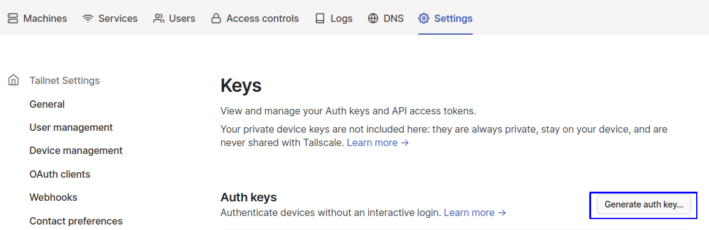
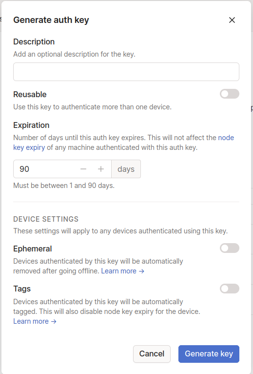
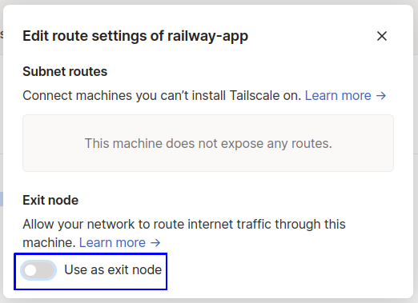
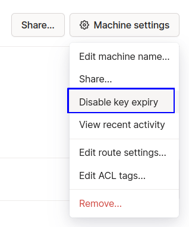

# Railway Tailscale VPN

## Overview

Host personal VPN on Railway using Tailscale

[](https://railway.app/new/template/uIBpGp?referralCode=KgmRt8)

## How to setup

1. To get started, you should create an account on [tailscale](https://tailscale.com), if you already have an account skip to next step

2. Go to you tailscale admin console settings then to [keys](https://login.tailscale.com/admin/settings/keys)

3. Click on 'Generate auth key ...'

    

4. Give you key a description then click 'Generate key' when you are finished

    

    Remember to take a note of the key because you'll see it only once

5. Go to railway and paste in the key in TAILSCALE_AUTHKEY variable

6. Deploy!

7. Go to your tailscale machines and approve railway-app as an exit node

    

8. Disable key expiry for the machine you just deployed

    

9. Use this command to connect to your VPN

    ```sh
    tailscale up --exit-node railway-app # or replace railway-app with your hostname
    ```

## More Info

[Tailscale](https://tailscale.com/)

[Tailscale Exit nodes](https://tailscale.com/kb/1103/exit-nodes/)

[Using Tailscale Auth Keys](https://tailscale.com/kb/1085/auth-keys/)
